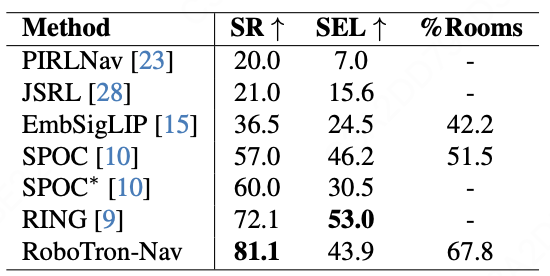

<div align="center">
  <h1>RoboTron-Nav: A Unified Framework for Embodied Navigation Integrating Perception, Planning, and Prediction
</h1>
</div>

<div align="center">
<a href='https://arxiv.org/abs/2503.18525'></a>&ensp;
<a href='https://huggingface.co/Albert-Zhong/RoboTron-Nav'></a>&ensp;
<a href='https://yvfengzhong.github.io/RoboTron-Nav/'></a>&ensp;
<a href=https://github.com/tatsu-lab/stanford_alpaca/blob/main/LICENSE></a>

Yufeng Zhong†, Chengjian Feng†, Feng Yan, Fanfan Liu, Liming Zheng, Lin Ma*
†Equal Contribution ‡Corresponding Authors
</div>

# 📢 News and Updates
* **[Dec 19, 2025]** 🎉 Evaluation code is now available!
* **[Dec 15, 2025]** 🤗 Model weights released on [Hugging Face](https://huggingface.co/Albert-Zhong/RoboTron-Nav)
* **[Jun 26, 2025]** 🏆 Our paper has been accepted to **ICCV 2025**!
* **[Mar 24, 2025]** 📄 Preprint released on [arXiv](https://arxiv.org/abs/2503.18525)

# 💡 Motivation

In (1) navigation tasks, only actions are produced, missing the perception and planning found in (2) EQA tasks. (3) Multitask collaboration unifies perception, planning, and prediction for a more comprehensive model.

# 🤖 Pipeline

Overview of RoboTron-Nav architecture. The current frame I<sub>t</sub> is initially processed through 2D and 3D feature extraction using the visual encoder. Then, historical features are filtered through the Adaptive 3D-aware History Sampling strategy. The visual features obtained, along with the accompanying linguistic instructions, are then fed into the large language model (LLM). Leveraging the Multitask Collaboration strategy, which significantly enhances navigation capabilities through joint training on both navigation and EQA tasks, the LLM produces two outputs via multimodal fusion: executable navigation actions and natural language answers.

# 📊 Performance

## Quantitative results


We compare with state-of-the-art navigation methods on the CHORES-S ObjectNav benchmark across three evaluation metrics: success rate (SR), episode-length weighted success (SEL), and percentage of rooms visited (%Rooms).

## Qualitative Results


Left: Both RoboTron-Nav and SPOC generate the shortest path when the agent is near the target (e.g., in the same room). Right: In contrast, SPOC fails due to repeatedly searching along the same paths when distant from the target (e.g., in different rooms), whereas RoboTron-Nav succeeds by effectively avoiding revisiting areas and exploring new ones.

# 🔍 Usage Example
1. Refer to the repository [https://github.com/EmbodiedAI-RoboTron/RoboTron-Mani](https://github.com/EmbodiedAI-RoboTron/RoboTron-Mani) to **configure the Python environment**.
2. Follow the instructions in [https://github.com/allenai/spoc-robot-training](https://github.com/allenai/spoc-robot-training) to **download the required datasets**, and set the two environment variables: `OBJAVERSE_HOUSES_DIR` and `OBJAVERSE_DATA_DIR`.
3. Modify the parameter `path_to_adds` in the file `robouniview/eval/eval_with_chores_new.py`, replacing its value with the path to your local `robotron-nav` code directory.
4. Download the pre-trained model from [https://huggingface.co/Albert-Zhong/RoboTron-Nav](https://huggingface.co/Albert-Zhong/RoboTron-Nav), place it in your target directory, and then update the placeholder path `/path/to/best/ckpt` in the script `eval.sh` to the actual model checkpoint path.
5. Execute the evaluation script by running the following command in the terminal:
```bash
bash eval.sh
```

# 📧 Contact
For any questions or collaboration inquiries, please don't hesitate to contact me at zhongyufeng21@mails.ucas.ac.cn.

# 📌 Acknowledgement
We sincerely appreciate [RoboTron-Mani](https://github.com/EmbodiedAI-RoboTron/RoboTron-Mani) for providing the reference training framework, and [spoc-robot-training](https://github.com/allenai/spoc-robot-training) for providing the training data.

# 📖 Citation
If you find this project useful, please feel free to leave a star and cite our paper:
```
@article{zhong2025p3nav,
  title={P3nav: A unified framework for embodied navigation integrating perception, planning, and prediction},
  author={Zhong, Yufeng and Feng, Chengjian and Yan, Feng and Liu, Fanfan and Zheng, Liming and Ma, Lin},
  journal={arXiv preprint arXiv:2503.18525},
  year={2025}
}
```
